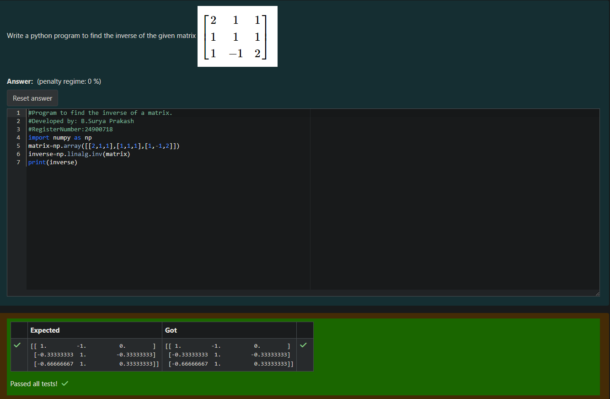

# INVERSE-OF-A-MATRIX
## Aim:
To write a python program to find the inverse of a matrix
## Equipment’s required:
1. 	Hardware – PCs
2. 	Anaconda – Python 3.7 Installation / Moodle-Code Runner
## Algorithm:
### Step1 : import the numpy library as np
### Step 2: The matrix is defined as a 2D array using the numpy.array() function.
### Step 3: The np.linalg.inv() function from the NumPy library is used to calculate the inverse of the matrix.
### Step 4: Print the Result

## Program:
    import numpy as np
    matrix=np.array([[2,1,1],[1,1,1],[1,-1,2]])
    inverse=np.linalg.inv(matrix)
    print(inverse)
## Output:

## Result:
Thus the inverse of given matrix is successfully solved using python program

